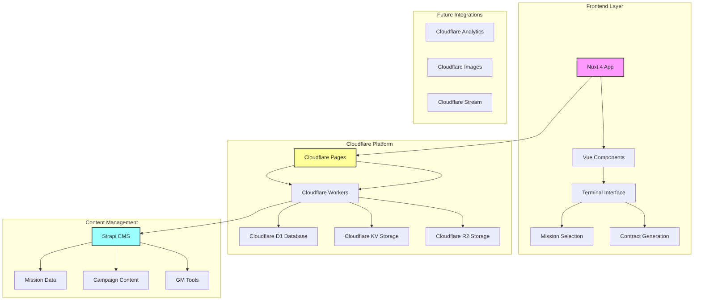

# Monarch TTRPG Terminal

A terminal-style interface for a tabletop RPG prototype, recreating the immersive sci-fi atmosphere of the Mothership RPG system. This app serves as a digital contractor selection terminal for players to choose their missions and receive contract codes for their game master.

## Overview

This NuxtHub application prototypes a TTRPG (tabletop role-playing game) concept that provides an interactive terminal interface where players can:

- Experience an authentic sci-fi boot sequence
- Browse available contractor missions
- Select assignments and receive unique contract codes
- Share contract codes with their GM for session setup

The app faithfully recreates the wireframe designed for the Mothership RPG system, featuring retro terminal aesthetics with green-on-black styling and typewriter effects.

## Architecture



## Current Implementation

### Phase 1 (Current)
- ✅ NuxtHub application setup with Nuxt 4
- ✅ Static recreation of HTML wireframe
- ✅ Terminal boot sequence with animations
- ✅ Mission selection interface
- ✅ Contract code generation
- ✅ Responsive design for various devices

### Phase 2 (Planned)
- Dynamic mission content from Strapi
- User session management
- GM dashboard for contract tracking
- Campaign management tools
- Player character integration

### Phase 3 (Future)
- Multi-player session support
- Real-time updates
- Advanced analytics
- Mobile companion app

## Technology Stack

- **Frontend**: Nuxt 4 with Vue 3
- **Styling**: TailwindCSS via Nuxt UI
- **Hosting**: Cloudflare Pages (via NuxtHub)
- **Backend**: Cloudflare Workers
- **Database**: Cloudflare D1 (SQLite)
- **Storage**: Cloudflare KV + R2
- **CMS**: Strapi (cloud-hosted)
- **Package Manager**: pnpm

## Development Setup

```bash
# Install dependencies
pnpm install

# Start development server
pnpm dev

# Build for production
pnpm build

# Deploy to Cloudflare
pnpm deploy

# Preview deployment
pnpm preview

# Lint code
pnpm lint
```

## Mission Types

The terminal currently features four contractor assignments:

1. **VR Dead** - Virtual Reality Systems Maintenance
2. **Another Bug Hunt** - Colonial Site Inspection
3. **Gradient Descent** - Deep Space Survey Mission
4. **Owe My Soul** - Employee Equity Program

Each mission generates a unique contract code that players share with their GM to begin their adventure.

## Features

- Authentic retro terminal aesthetic
- Typewriter text animations with realistic delays
- Loading bars and system status indicators
- Interactive mission selection
- Unique contract code generation
- Easter egg content for curious players
- Responsive design for desktop and mobile

## Project Structure (Nuxt 4)

```
monarch/
├── app/                    # Nuxt 4 app directory
│   ├── components/         # Vue components
│   ├── pages/             # File-based routing
│   ├── layouts/           # App layouts
│   ├── middleware/        # Route middleware
│   ├── plugins/           # Vue plugins
│   ├── composables/       # Auto-imported composables
│   ├── utils/             # Auto-imported utilities
│   └── assets/            # Build-time assets
├── server/                # Server-side API routes
├── public/                # Static assets
├── doc/                   # Documentation and wireframes
├── nuxt.config.ts         # Nuxt configuration
└── package.json           # Project dependencies
```

## Nuxt 4 Features

This project leverages Nuxt 4's latest features:

- **New Directory Structure**: Uses the `app/` directory for better organization
- **Enhanced Auto-imports**: Improved composables and utilities auto-importing
- **Better TypeScript Support**: Enhanced type safety and inference
- **Optimized Build**: Faster builds and better tree-shaking
- **Modern Vue 3**: Latest Vue 3 features and composition API

## Contributing

This is a prototype project for personal TTRPG use. The codebase follows Nuxt 4 conventions and uses TypeScript for type safety.

## License

Private project for tabletop gaming use.

